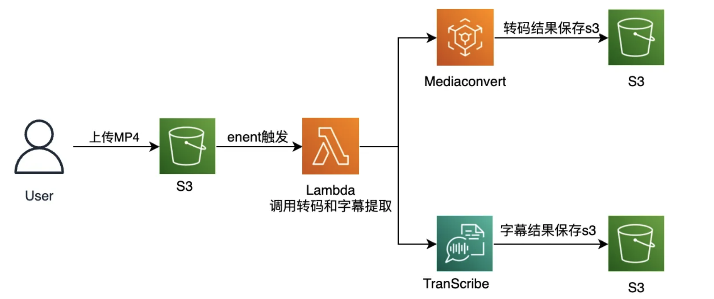
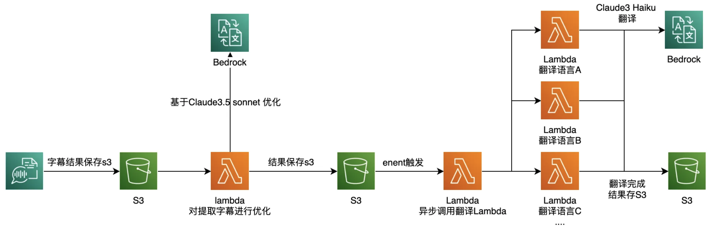
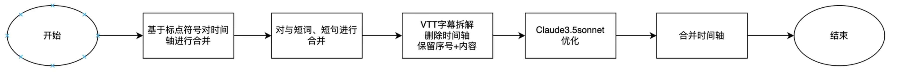

# 视频字幕翻译系统

这个项目是一个基于 AWS Lambda 的视频字幕翻译系统，可以自动处理上传到 S3 存储桶的 VTT 格式字幕文件，进行字幕优化和多语言翻译。

## 说明

在视频点播(VOD)项目中，除了常规的转码需求外，提取音频并生成字幕文件也是一项关键功能。基于AWS云原生服务的转码和字幕提取方案已有很多的介绍，本文将重点探讨如何优化提取后的字幕，并实现更精准的多语言字幕翻译，以满足企业全球化业务发展的需求。

视频转码+语音提取转字幕方案：


实践中我们发现，无论是使用AWS Transcribe服务还是部署开源模型Whisper进行字幕提取，都存在一些共同的挑战：

1. 同音词和特定语言短语的识别错误
2. 断句不准确
3. 时间轴内容过短
4. 过多口语语气词

此外，字幕翻译本身也面临诸多难点。由于翻译内容需要与时间轴完全匹配，传统翻译方法往往将每个时间轴段落独立处理。然而，当单个时间轴内的语句不完整，缺乏上下文理解，加之字幕提取存在上述问题时，翻译质量inevitably会受到影响。

鉴于此，本文将探讨如何利用Claude人工智能模型的能力，对原始字幕进行优化和翻译，从而显著提升字幕的准确性和翻译质量。这种方法不仅能解决字幕提取中的常见问题，还能为多语言字幕制作提供更高效、更精准的解决方案。

## 整体方案



本方案可分为两个主要环节：原始VTT或SRT字幕的优化，以及基于优化后字幕的多语言翻译。整个方案基于Serverless架构，核心依托于Bedrock Claude模型的处理能力。

我们先看优化环节：



整个优化流程可细分为以下步骤：

1. 基于识别的标点符号对字幕内容进行语句合并，尽可能确保完整语句位于同一时间轴内。
2. 合并时间轴特别短的内容片段，如仅包含单个词的段落。
3. 将字幕时间轴与内容进行分离。
4. 调用大语言模型进行内容优化。 
5. 合并时间轴，保存输出


翻译相对来说比较简单，利用Claude进行翻译，相比传统SaaS翻译服务基于上下文理解，翻译的更加准备，成本也更加低。

## 系统架构

系统由三个 AWS Lambda 函数组成，形成一个处理流水线：

1. **subtitle-call**: 监听 S3 存储桶事件，根据上传文件的路径决定调用哪个处理函数
2. **subtitle-optimization**: 对原始字幕进行优化，包括语句合并、校对和修正
3. **subtitle-translate**: 将优化后的字幕翻译成指定的语言

```
                  ┌─────────────────┐
                  │                 │
                  │  S3 存储桶事件    │
                  │                 │
                  └────────┬────────┘
                           │
                           ▼
                  ┌─────────────────┐
                  │                 │
                  │  subtitle-call  │
                  │                 │
                  └────────┬────────┘
                           │
                  ┌────────┴────────┐
                  │                 │
          ┌───────▼───────┐   ┌─────▼───────────┐
          │               │   │                 │
┌─────────▼─────────┐     │   │                 │
│                   │     │   │                 │
│subtitle-optimization    │   │ subtitle-translate
│                   │     │   │                 │
└─────────┬─────────┘     │   │                 │
          │               │   │                 │
          └───────────────┘   └─────────────────┘
```

## 工作流程

1. 用户将 VTT 格式的字幕文件上传到 S3 存储桶的 `source` 目录
2. `subtitle-call` 函数被触发，检测到文件在 `source` 目录，调用 `subtitle-optimization` 函数
3. `subtitle-optimization` 函数处理字幕文件：
   - 合并不完整的语句
   - 使用 AWS Bedrock 的 Claude 模型优化字幕内容
   - 将优化后的字幕保存到 S3 存储桶的 `optimized` 目录
4. `subtitle-call` 函数检测到新文件在 `optimized` 目录，调用 `subtitle-translate` 函数
5. `subtitle-translate` 函数将字幕翻译成指定的语言（目前支持简体中文和土耳其语），并将翻译后的字幕保存到 S3 存储桶的 `subtitle` 目录

## 功能特点

- **自动化处理流程**：上传原始字幕文件后，系统自动完成优化和翻译
- **高质量字幕优化**：使用 AWS Bedrock 的 Claude 模型进行智能字幕校对和优化
- **多语言翻译支持**：可以将字幕翻译成多种语言
- **并行处理**：使用线程池并行处理大量字幕，提高效率
- **错误处理和重试机制**：包含完善的错误处理和重试逻辑，确保处理可靠性

## 配置参数

系统通过环境变量进行配置，主要参数包括：

- `MAX_CONCURRENT_THREADS`：并发处理线程数
- `BATCH_SIZE`：每批处理的字幕数量
- `MERGE_NUM`：字幕合并的最大数量
- `MODEL_ID`：使用的 AWS Bedrock 模型 ID
- `REGION`：AWS 区域
- `MAX_TOKENS`：模型生成的最大 token 数

## 部署说明

系统需要部署在 AWS 环境中，并配置相应的 IAM 权限：

1. 创建 S3 存储桶，并设置适当的权限
2. 部署三个 Lambda 函数，并配置环境变量
3. 设置 S3 事件触发器，将 `subtitle-call` 函数与 S3 存储桶关联

## 使用方法

1. 将 VTT 格式的字幕文件上传到 S3 存储桶的 `source` 目录
2. 系统自动处理字幕文件，优化后的字幕将保存在 `optimized` 目录
3. 翻译后的字幕将保存在 `subtitle` 目录，文件名格式为 `原文件名_语言代码.vtt`

## 依赖项

- AWS Lambda
- AWS S3
- AWS Bedrock
- boto3 Python SDK
